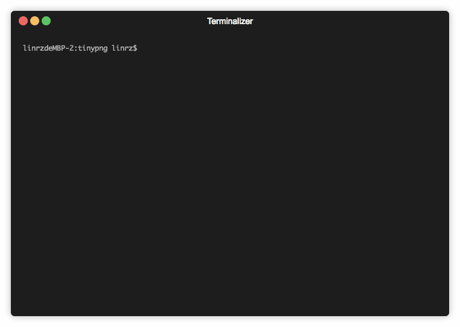

# Tinypng Tool


## Install
```shell
npm install tinypng-tools -g
```
## Example


## Usage
```shell
tinypng <path> [options]

tinypng --key=your key

tinypng ./images/test.png

tinypng ./images -r

tinypng ./images/test.png --dist=./resources
```

## License
**tinypng-tools** © [linrz](https://github.com/linrz), Released under the [MIT](./LICENSE) License.